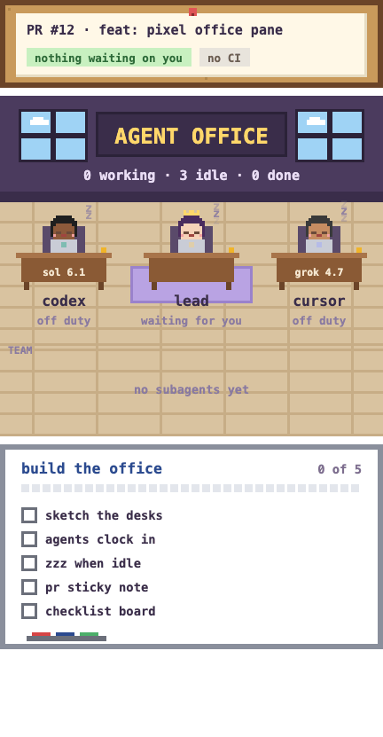

# Agent Office

A view-only pixel office for Claude Code. Each agent working in your session gets a desk: the lead session, every subagent it spawns, and the Codex and Cursor CLIs when it calls them. The same pane shows a whiteboard with your current checklist and a row for this branch's pull request.

<p align="center"></p>

It never acts on its own. It watches the session's hooks and draws what it sees. The one exception is the **Draft replies** button, which sends a prompt only when you press it.

> **Early access.** This is a Claude Code *mod* built on the function-hook plugin API (`register`, `$.state`, `ui.render`). That API may change between releases. Tested with Claude Code 2.1.286.

## What it shows

**Desks**
- **lead:** the main session. It shows *thinking* during a turn, or the tool it's running (Read, Edit, Bash…).
- **subagents:** a desk per spawned agent, named after its type, with its model family, task and live activity. Desks go ✓ or ✗ when the agent finishes, and are cleared 3 minutes later.
- **codex:** lights up for `codex exec`, claude-harness's `harness-codex`, and `mcp__codex__*` tool calls.
- **cursor:** lights up for `cursor-agent`.

**Whiteboard** (the current checklist, the newest of):
- a checklist you paste into a prompt (`- [ ] item`, `- [x] done`, `- [~] in progress`; at least 2 items). Checkboxes inside fenced code blocks are ignored, so PR templates don't count.
- a checklist Claude writes in a reply.
- one Claude sets or ticks with the `checklist` tool.
- a `plan.json` the pane follows on its own (see below).

**PR row:** the open PR for the checked-out branch, or the last PR URL you pasted or a command printed. It shows:
- CI state
- unresolved review threads, and how many of them wait on you
- new comments since you last looked
- the latest comment

When threads wait on you, a **Draft replies** button asks Claude to draft them. This needs the GitHub CLI (`gh`), signed in.

The desktop app shows the pixel office. A terminal session shows the same information as a compact text list.

## Install

Clone the repo anywhere, then load it as a plugin directory:

```bash
git clone https://github.com/ririversoza/agent-office.git ~/.claude/mods/agent-office
```

For one session:

```bash
claude --plugin-dir ~/.claude/mods/agent-office
```

For every session, including the desktop app, add the folder to `CLAUDE_CODE_PLUGIN_DIRS` (colon-separated) in your shell profile, then restart Claude Code:

```bash
export CLAUDE_CODE_PLUGIN_DIRS="$HOME/.claude/mods/agent-office${CLAUDE_CODE_PLUGIN_DIRS:+:$CLAUDE_CODE_PLUGIN_DIRS}"
```

The pane opens by itself the first time there is something to show: a subagent starts, a checklist appears, or a PR needs you. To open it at any time, run `/office`.

## Tools it gives Claude

| Tool | What it does |
|---|---|
| `mcp__agent-office__checklist` | Show a new checklist (`title` + `items`), tick items (`updates: [{item, status}]` with `todo`/`doing`/`done`), or follow a `planFile`. |
| `mcp__agent-office__usage` | The account's rate-limit windows (`five_hour`, `seven_day`) with `percentUsed` and `resetsAt`, so an agent can check its headroom before a large batch. |

### Following a plan file

Pass `planFile` with the absolute path of a JSON file shaped like this:

```json
{ "goal": "export endpoint", "tasks": [ { "id": "T1", "title": "acceptance tests", "status": "done" },
                                        { "id": "T2", "title": "endpoint", "status": "doing" } ] }
```

The whiteboard rereads it every few seconds, so whatever updates the file also updates the pane, with no tool calls. `status` is `todo`, `doing`, `done` or `failed`. A task with `"account": "work"` is labelled as such. A checklist set any other way takes over the board.

## Privacy

Everything runs locally inside Claude Code. The only outside calls are `gh pr view` and `gh api graphql`, run as you, for the PR row. The mod stores its state (desks, checklist, PR) in Claude Code's plugin state and the time you last looked at each PR in its plugin store.

## Limits

- The PR row reads at most 2,000 review threads and the newest 100 comments per thread.
- Codex and Cursor are detected from the commands Claude runs, so a CLI started some other way (a wrapper with another name, a different terminal) is not seen.
- Desk model labels come from the subagent's model. Codex and Cursor desks have no model label, because their CLIs don't report one.

## Development

```bash
claude plugin test .        # runs tests/*.test.ts
claude plugin validate .
```

Claude Code writes the API's type declarations to `.claude-plugin/types/` whenever it loads the mod (they are git-ignored), so load it once before using an editor's type checker.

```
hooks/register.tsx   hook wiring: session, prompts, replies, tools, agents, the pane
hooks/state.ts       desks: who is working on what
hooks/checklist.ts   checklist parsing, ticking, plan.json following, the tool's schema
hooks/pr.ts          PR status from gh: CI, review threads, new comments
hooks/scene.ts, pixels.ts, boards.ts, pane.tsx   drawing the office, whiteboard and PR board
types/index.d.ts     the mod's state shapes
```

## License

MIT
